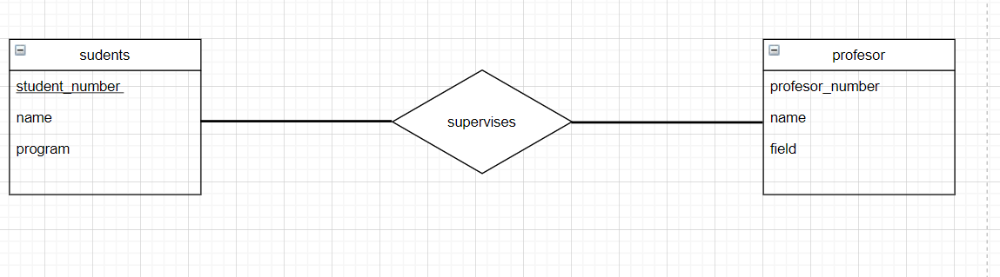
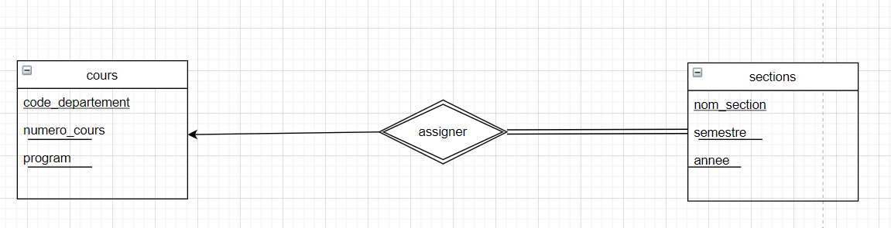
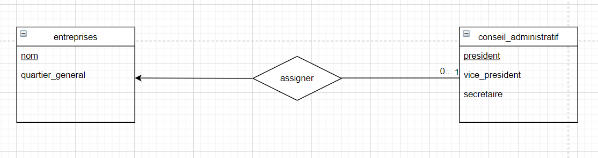
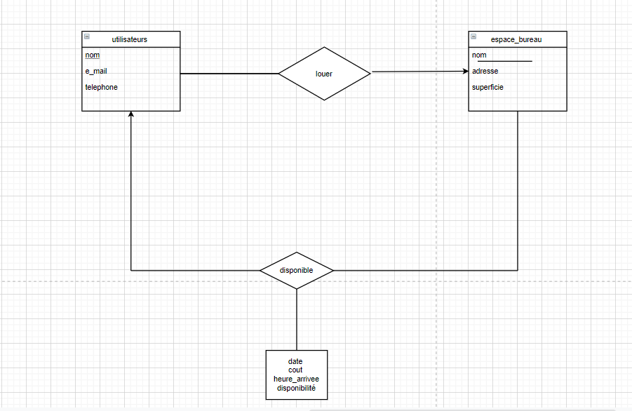
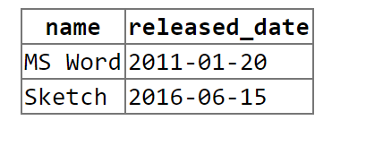

# CSI 2532- Devoir 1

# Partie A
## A1: Relations, cardinalité et participation

### a)
Un étudiant peut être supervisé par plusieurs professeurs, et un professeur peut
superviser plusieurs étudiants. Un étudiant a un numéro d'étudiant, un nom et est inscrit dans
un programme spécifique. Un professeur a un numéro d'employé, nom et domaine d'expertise

 on a le diagramme suivant
 

### b)
Toutes les sections de cours doivent être affectées à un cours. Un cours a un code
de département (par exemple CSI ou SEG) et un numéro de cours (par exemple 2532 ou 4105).
Une section de cours est défini uniquement par le nom de la section (par exemple A ou B ou C),
semestre (par exemple hiver), l'année et le cours lui-même. Une section de cours dépend sur le
cours.

on a le diagramme suivant


### c)
Une entreprise a un nom et un quartier général (spécifié par pays). Un conseil d'administration a
un président, un vice-président, et secrétaire (juste leurs noms). Une entreprise peut avoir au
plus un conseil administrateurs (mais il n'en a pas besoin). Tout les conseils d'administration
doivent avoir une et une seule entreprise à gérer.

on a le diagramme suivant


## A2
Modélisez le système ci-dessus à l'aide d'un diagramme Entité-Relation. Vous devez inclure les
entités, les relations, la cardinalité, la participation et les attributs. Vous n'avez pas besoin de
spécifier les types d'attributs (c'est-à-dire le domaine).



## A3: Algèbre relationnelle
Écrivez des requêtes à l'aide de l'algèbre relationnelle pour les situations suivantes.

a) Trouvez tous les espaces de bureau à Ottawa qui sont disponibles le 2 mars 2020
**πadresse,disponibilite(espace_bureau)=′ottawa′,'2020-03-02'(disponible)**

b) Trouvez tous les utilisateurs (nom et email) et les détails de la propriété (nom et
ville) et les informations de location (date et coût quotidien) de toutes les bureaux loués du mois
de janvier 2020.
**πnom,email(Logement),πnom,ville(espace_bureau),πdate,cout(disponible)**

# Partie B  SQL
## B1
Affichons les resultats des requetes SQL suivantes
### a)
sortie de la premiere requete

|name  |experience|
|------|---|
|andrew|2 |
|august|0|
hayden|1|


### b)


### c )
ERROR
```
Uncaught Error: table users_2019 has 3 values for 2 columns
```
En gros, la table users_2019 a besoin de prendre 3 values alors on va ajouter l'attribut join_date et enlever l'id de la commande select on aurra donc :
```sql
WITH users_2019 (id, name,join_date) AS
(SELECT *
 FROM users
 WHERE join_date BETWEEN '2019-01-01' AND '2019-12-31')
SELECT name,
       count(licenses.access_code) AS num
FROM users_2019
LEFT JOIN licenses ON licenses.user_id = id
GROUP BY name
ORDER BY num DESC;
```
SORTIE

|name  |num|
|------|---|
|hayden|1  |


## B2 Écriture de requêtes SQL

### a)Trouvez les noms de tous les utilisateurs qui se sont inscrits avant le 1er janvier 2020

```sql
SELECT name
FROM users
WHERE join_date < '2020-01-01';
```

### b) Trouvez le nombre de licences logicielles de chaque utilisateur (même celles sans licence). Triez les résultats par nombre de licences (du plus au moins), puis par nom (A - Z).

```sql
SELECT users.name, count(licenses.user_id) as num_licenses
FROM users
LEFT JOIN licenses on licenses.user_id = users.id
GROUP BY users.name
ORDER BY num_licenses DESC, name ASC;
```
### c) Insérez des données dans la base de données pour démontrer que les résultats sont triés correctement en (b).

INSERTION
```sql
INSERT INTO users (id, name, join_date)
VALUES
(56, 'Fabienne', '2017-01-01'),
(60, 'Guellord', '2021-01-01');
```
SORTIE
|name  | num_licenses|
|------|-------------|
|andrew|2|
|august|1|
|ayana|1|
|hayden|1|
|Fabienne|0|
|Guellord|0|

### d) Mettez à jour la version de sketch à la version "51" (publié le 1 janvier 2020).
```sql
UPDATE softwares
SET version='51'
WHERE version = 'Sketch'
```

## B3) Mise à jour le schéma SQL

### a) Trouvez les noms de tous les utilisateurs qui se sont inscrits avant le 1er janvier 2020

les questions qui suivent se font particulierement avec des migrations

```sql

ALTER TABLE licenses
ADD COLUMN log_version varchar(200);
UPDATE licenses
SET log_version =
(SELECT version
FROM softwares
WHERE name = software_name);

```
### b) Mettez à jour la table des softwares pour inclure le nom ET la version comme clé primaire.

```sql
ALTER TABLE licenses DROP CONSTRAINT softwares_pkey;
ALTER TABLE licenses DROP CONSTRAINT licenses_software_name_fkey;
ALTER TABLE licenses ADD PRIMARY KEY (name, version);
ALTER TABLE licenses ADD FOREIGN KEY (software_name,
log_version) REFERENCES  softwares (name, version);
```

### c )

```sql
BEGIN;
ALTER TABLE licenses DROP CONSTRAINT licenses_pkey ;
ALTER TABLE licenses ADD PRIMARY KEY (user_id, software_name, log_version)
COMMIT;
```
on va maintenant verifier si ca marche
```sql
INSERT INTO licences
(user_id, software_name, log_version, access_code)
SELECT id
'Sketch'
'52'
'xxxyyy111'
FROM users
WHERE name = 'andrew'
```

### d) avec la mis a jours 1 month free

```sql
INSERT INTO licences (user_id,software_name, log_version, access_code)
SELECT id ,
     'Sketch'
     '52'
     '1monthfree'
  FROM users
  SELECT user_id
  FROM licences
  WHERE (software_name, log_version)= ('Sketch', '52');
